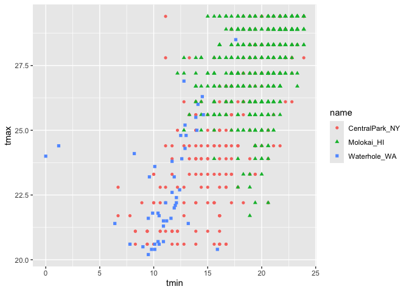

EDA
================
Chhiring Lama
2024-10-03

``` r
weather_df = 
  rnoaa::meteo_pull_monitors(
    c("USW00094728", "USW00022534", "USS0023B17S"),
    var = c("PRCP", "TMIN", "TMAX"), 
    date_min = "2021-01-01",
    date_max = "2022-12-31") |>
  mutate(
    name = recode(
      id, 
      USW00094728 = "CentralPark_NY", 
      USW00022534 = "Molokai_HI",
      USS0023B17S = "Waterhole_WA"),
    tmin = tmin / 10,
    tmax = tmax / 10,
    month = lubridate::floor_date(date, unit = "month")) |>
  select(name, id, everything())
```

    ## using cached file: /Users/chhiringlama2/Library/Caches/org.R-project.R/R/rnoaa/noaa_ghcnd/USW00094728.dly

    ## date created (size, mb): 2024-09-26 10:18:03.970907 (8.651)

    ## file min/max dates: 1869-01-01 / 2024-09-30

    ## using cached file: /Users/chhiringlama2/Library/Caches/org.R-project.R/R/rnoaa/noaa_ghcnd/USW00022534.dly

    ## date created (size, mb): 2024-09-26 10:18:15.614742 (3.932)

    ## file min/max dates: 1949-10-01 / 2024-09-30

    ## using cached file: /Users/chhiringlama2/Library/Caches/org.R-project.R/R/rnoaa/noaa_ghcnd/USS0023B17S.dly

    ## date created (size, mb): 2024-09-26 10:18:19.186102 (1.036)

    ## file min/max dates: 1999-09-01 / 2024-09-30

``` r
weather_df
```

    ## # A tibble: 2,190 × 7
    ##    name           id          date        prcp  tmax  tmin month     
    ##    <chr>          <chr>       <date>     <dbl> <dbl> <dbl> <date>    
    ##  1 CentralPark_NY USW00094728 2021-01-01   157   4.4   0.6 2021-01-01
    ##  2 CentralPark_NY USW00094728 2021-01-02    13  10.6   2.2 2021-01-01
    ##  3 CentralPark_NY USW00094728 2021-01-03    56   3.3   1.1 2021-01-01
    ##  4 CentralPark_NY USW00094728 2021-01-04     5   6.1   1.7 2021-01-01
    ##  5 CentralPark_NY USW00094728 2021-01-05     0   5.6   2.2 2021-01-01
    ##  6 CentralPark_NY USW00094728 2021-01-06     0   5     1.1 2021-01-01
    ##  7 CentralPark_NY USW00094728 2021-01-07     0   5    -1   2021-01-01
    ##  8 CentralPark_NY USW00094728 2021-01-08     0   2.8  -2.7 2021-01-01
    ##  9 CentralPark_NY USW00094728 2021-01-09     0   2.8  -4.3 2021-01-01
    ## 10 CentralPark_NY USW00094728 2021-01-10     0   5    -1.6 2021-01-01
    ## # ℹ 2,180 more rows

Lets make some plot

``` r
weather_df |> 
  ggplot(aes(x = prcp)) +
  geom_histogram()
```

    ## `stat_bin()` using `bins = 30`. Pick better value with `binwidth`.

    ## Warning: Removed 15 rows containing non-finite outside the scale range
    ## (`stat_bin()`).

<!-- -->

``` r
weather_df |>
  filter(prcp > 1000)
```

    ## # A tibble: 3 × 7
    ##   name           id          date        prcp  tmax  tmin month     
    ##   <chr>          <chr>       <date>     <dbl> <dbl> <dbl> <date>    
    ## 1 CentralPark_NY USW00094728 2021-08-21  1130  27.8  22.8 2021-08-01
    ## 2 CentralPark_NY USW00094728 2021-09-01  1811  25.6  17.2 2021-09-01
    ## 3 Molokai_HI     USW00022534 2022-12-18  1120  23.3  18.9 2022-12-01

``` r
weather_df |> 
  filter(tmax > 20, tmax < 30) |> 
  ggplot(aes(x = tmin, y = tmax, color = name, shape = name)) +
  geom_point()
```

<!-- -->

Central park and Molakai’s tmax is different (more separated) than
Waterhole.

## group_by()

``` r
weather_df |> 
  group_by(name)
```

    ## # A tibble: 2,190 × 7
    ## # Groups:   name [3]
    ##    name           id          date        prcp  tmax  tmin month     
    ##    <chr>          <chr>       <date>     <dbl> <dbl> <dbl> <date>    
    ##  1 CentralPark_NY USW00094728 2021-01-01   157   4.4   0.6 2021-01-01
    ##  2 CentralPark_NY USW00094728 2021-01-02    13  10.6   2.2 2021-01-01
    ##  3 CentralPark_NY USW00094728 2021-01-03    56   3.3   1.1 2021-01-01
    ##  4 CentralPark_NY USW00094728 2021-01-04     5   6.1   1.7 2021-01-01
    ##  5 CentralPark_NY USW00094728 2021-01-05     0   5.6   2.2 2021-01-01
    ##  6 CentralPark_NY USW00094728 2021-01-06     0   5     1.1 2021-01-01
    ##  7 CentralPark_NY USW00094728 2021-01-07     0   5    -1   2021-01-01
    ##  8 CentralPark_NY USW00094728 2021-01-08     0   2.8  -2.7 2021-01-01
    ##  9 CentralPark_NY USW00094728 2021-01-09     0   2.8  -4.3 2021-01-01
    ## 10 CentralPark_NY USW00094728 2021-01-10     0   5    -1.6 2021-01-01
    ## # ℹ 2,180 more rows

counting the values

``` r
weather_df |> 
  group_by(name) |> 
  summarize(n_obs = n(), 
            n_dist = n_distinct(month))
```

    ## # A tibble: 3 × 3
    ##   name           n_obs n_dist
    ##   <chr>          <int>  <int>
    ## 1 CentralPark_NY   730     24
    ## 2 Molokai_HI       730     24
    ## 3 Waterhole_WA     730     24

## 2x2 tables

``` r
weather_df |> 
  drop_na(tmax) |> 
  mutate(
    cold_cat = case_when(
      tmax < 5 ~ "cold", 
      tmax >= 5 ~ "not cold"
    )
  ) |> 
  group_by(name, cold_cat) |> 
  summarize(count = n()) |> 
  pivot_wider(
    names_from = "cold_cat",
    values_from = "count"
  )
```

    ## `summarise()` has grouped output by 'name'. You can override using the
    ## `.groups` argument.

    ## # A tibble: 3 × 3
    ## # Groups:   name [3]
    ##   name            cold `not cold`
    ##   <chr>          <int>      <int>
    ## 1 CentralPark_NY    96        634
    ## 2 Molokai_HI        NA        729
    ## 3 Waterhole_WA     319        395

``` r
weather_df |> 
  drop_na(tmax) |> 
  mutate(
    cold_cat = case_when(
      tmax < 5 ~ "cold", 
      tmax >= 5 ~ "not cold"
    )
  ) |> 
  janitor::tabyl(name, cold_cat)
```

    ##            name cold not cold
    ##  CentralPark_NY   96      634
    ##      Molokai_HI    0      729
    ##    Waterhole_WA  319      395

## General Numeric Summaries

Computing other useful summaries:

``` r
weather_df |> 
  group_by(name) |> 
  summarize(
    mean_tmax = mean(tmax, na.rm = TRUE), 
    median_tmin = median(tmin, a.rm = TRUE), 
    sd_prcp = sd(prcp, na.rm = TRUE)
  )
```

    ## # A tibble: 3 × 4
    ##   name           mean_tmax median_tmin sd_prcp
    ##   <chr>              <dbl>       <dbl>   <dbl>
    ## 1 CentralPark_NY     17.7           10   113. 
    ## 2 Molokai_HI         28.3           NA    63.2
    ## 3 Waterhole_WA        7.38          NA   111.

plot one of the summaries:

``` r
weather_df |> 
  group_by(name, month) |> 
  summarize(
    mean_tmax = mean(tmax, na.rm = TRUE), 
    median_tmin = median(tmin, a.rm = TRUE), 
    sd_prcp = sd(prcp, na.rm = TRUE)
  ) |> 
  ggplot(aes(x = month, y = mean_tmax, color = name)) +
  geom_point() +
  geom_line()
```

    ## `summarise()` has grouped output by 'name'. You can override using the
    ## `.groups` argument.

<!-- -->

Format for readers

``` r
weather_df |> 
  group_by(name, month) |> 
  summarize(
    mean_tmax = mean(tmax, na.rm = TRUE)
  ) |> 
  pivot_wider(
    names_from = name,
    values_from = mean_tmax
  ) |> 
  knitr::kable(digits = 3, 
                col.names = c("Month", "Central Park", "Molokai", "Waterhole"))
```

    ## `summarise()` has grouped output by 'name'. You can override using the
    ## `.groups` argument.

| Month      | Central Park | Molokai | Waterhole |
|:-----------|-------------:|--------:|----------:|
| 2021-01-01 |        4.271 |  27.616 |     0.800 |
| 2021-02-01 |        3.868 |  26.368 |    -0.786 |
| 2021-03-01 |       12.294 |  25.861 |     2.623 |
| 2021-04-01 |       17.607 |  26.567 |     6.097 |
| 2021-05-01 |       22.084 |  28.577 |     8.203 |
| 2021-06-01 |       28.057 |  29.587 |    15.253 |
| 2021-07-01 |       28.352 |  29.994 |    17.335 |
| 2021-08-01 |       28.810 |  29.523 |    17.152 |
| 2021-09-01 |       24.787 |  29.673 |    12.647 |
| 2021-10-01 |       19.926 |  29.129 |     5.481 |
| 2021-11-01 |       11.537 |  28.847 |     3.533 |
| 2021-12-01 |        9.587 |  26.190 |    -2.097 |
| 2022-01-01 |        2.855 |  26.606 |     3.606 |
| 2022-02-01 |        7.650 |  26.829 |     2.989 |
| 2022-03-01 |       11.990 |  27.726 |     3.416 |
| 2022-04-01 |       15.810 |  27.723 |     2.463 |
| 2022-05-01 |       22.255 |  28.283 |     5.810 |
| 2022-06-01 |       26.090 |  29.157 |    11.127 |
| 2022-07-01 |       30.723 |  29.529 |    15.861 |
| 2022-08-01 |       30.500 |  30.697 |    18.830 |
| 2022-09-01 |       24.923 |  30.413 |    15.207 |
| 2022-10-01 |       17.426 |  29.223 |    11.884 |
| 2022-11-01 |       14.017 |  27.960 |     2.140 |
| 2022-12-01 |        6.761 |  27.348 |    -0.460 |

## grouped mutate

``` r
weather_df |> 
  group_by(name) |> 
  mutate(mean_tmax = mean(tmax, na.rm = TRUE), 
         centered_tmax = tmax - mean_tmax) |> 
  ggplot(aes(x = date, y = centered_tmax, color = name)) +
  geom_point()
```

    ## Warning: Removed 17 rows containing missing values or values outside the scale range
    ## (`geom_point()`).

<!-- -->

## window functions

Find hottest/ coldest days

``` r
weather_df |> 
  group_by(name) |> 
  mutate(
    temp_rank = min_rank(tmax)
  ) |> 
  filter(temp_rank < 4)
```

    ## # A tibble: 9 × 8
    ## # Groups:   name [3]
    ##   name           id          date        prcp  tmax  tmin month      temp_rank
    ##   <chr>          <chr>       <date>     <dbl> <dbl> <dbl> <date>         <int>
    ## 1 CentralPark_NY USW00094728 2022-01-15     0  -6   -12.1 2022-01-01         2
    ## 2 CentralPark_NY USW00094728 2022-01-21     0  -5.5  -9.9 2022-01-01         3
    ## 3 CentralPark_NY USW00094728 2022-12-24     0  -9.3 -13.8 2022-12-01         1
    ## 4 Molokai_HI     USW00022534 2021-01-18   234  22.2  19.4 2021-01-01         2
    ## 5 Molokai_HI     USW00022534 2021-03-18   142  21.7  18.9 2021-03-01         1
    ## 6 Molokai_HI     USW00022534 2022-11-28    56  22.2  20.6 2022-11-01         2
    ## 7 Waterhole_WA   USS0023B17S 2021-12-26   102 -11.4 -18.3 2021-12-01         1
    ## 8 Waterhole_WA   USS0023B17S 2021-12-27    25  -9.8 -19.6 2021-12-01         2
    ## 9 Waterhole_WA   USS0023B17S 2022-12-21     0  -9.6 -18.4 2022-12-01         3

``` r
weather_df |> 
  group_by(name) |> 
  filter(min_rank(tmax) < 4) |> 
  arrange(tmax)
```

    ## # A tibble: 9 × 7
    ## # Groups:   name [3]
    ##   name           id          date        prcp  tmax  tmin month     
    ##   <chr>          <chr>       <date>     <dbl> <dbl> <dbl> <date>    
    ## 1 Waterhole_WA   USS0023B17S 2021-12-26   102 -11.4 -18.3 2021-12-01
    ## 2 Waterhole_WA   USS0023B17S 2021-12-27    25  -9.8 -19.6 2021-12-01
    ## 3 Waterhole_WA   USS0023B17S 2022-12-21     0  -9.6 -18.4 2022-12-01
    ## 4 CentralPark_NY USW00094728 2022-12-24     0  -9.3 -13.8 2022-12-01
    ## 5 CentralPark_NY USW00094728 2022-01-15     0  -6   -12.1 2022-01-01
    ## 6 CentralPark_NY USW00094728 2022-01-21     0  -5.5  -9.9 2022-01-01
    ## 7 Molokai_HI     USW00022534 2021-03-18   142  21.7  18.9 2021-03-01
    ## 8 Molokai_HI     USW00022534 2021-01-18   234  22.2  19.4 2021-01-01
    ## 9 Molokai_HI     USW00022534 2022-11-28    56  22.2  20.6 2022-11-01

Lagged information (creating a color and shifting down by one row, data
needs to be pre-ordered)

``` r
weather_df |> 
  group_by(name) |> 
  mutate(
    lagged_temp = lag(tmax), 
    temp_change = tmax - lagged_temp
  ) |> 
  filter(min_rank(temp_change) < 3) |> 
  arrange(desc(abs(temp_change)))
```

    ## # A tibble: 6 × 9
    ## # Groups:   name [3]
    ##   name     id    date        prcp  tmax  tmin month      lagged_temp temp_change
    ##   <chr>    <chr> <date>     <dbl> <dbl> <dbl> <date>           <dbl>       <dbl>
    ## 1 Central… USW0… 2022-12-24     0  -9.3 -13.8 2022-12-01        14.4       -23.7
    ## 2 Central… USW0… 2022-02-24     0   1.7  -1.6 2022-02-01        20         -18.3
    ## 3 Waterho… USS0… 2022-06-28     0  12.4   5.7 2022-06-01        23.6       -11.2
    ## 4 Waterho… USS0… 2021-06-30     0  21.5  10.9 2021-06-01        32.4       -10.9
    ## 5 Molokai… USW0… 2021-01-18   234  22.2  19.4 2021-01-01        27.8        -5.6
    ## 6 Molokai… USW0… 2022-11-28    56  22.2  20.6 2022-11-01        27.2        -5

``` r
weather_df |> 
  group_by(name) |> 
  mutate(
    lagged_temp = lag(tmax), 
    temp_change = tmax - lagged_temp
  ) |> 
  summarize(
    sd_tmax_change = sd(temp_change, na.rm = TRUE)
  )
```

    ## # A tibble: 3 × 2
    ##   name           sd_tmax_change
    ##   <chr>                   <dbl>
    ## 1 CentralPark_NY           4.43
    ## 2 Molokai_HI               1.24
    ## 3 Waterhole_WA             3.04

## Learning Assessment1:

In the PULSE data, the primary outcome is BDI score; it’s observed over
follow-up visits, and we might ask if the typical BDI score values are
roughly similar at each. Try to write a code chunk that imports, cleans,
and summarizes the PULSE data to examine the mean and median at each
visit. Export the results of this in a reader-friendly format.

### Solution:

``` r
pulse_df <- read_sas("Data/public_pulse_data.sas7bdat") |> 
  janitor::clean_names() |> 
  pivot_longer(
    bdi_score_bl:bdi_score_12m, 
    names_to = "visit", 
    values_to = "bdi_score", 
    names_prefix = "bdi_score_"
  )

pulse_df |> 
  group_by(visit) |> 
  summarize(
    mean_bdi = mean(bdi_score, na.rm = TRUE), 
    median_bdi = median(bdi_score, na.rm = TRUE)
  ) |> 
    knitr::kable(digits = 1)
```

| visit | mean_bdi | median_bdi |
|:------|---------:|-----------:|
| 01m   |      6.0 |          4 |
| 06m   |      5.7 |          4 |
| 12m   |      6.1 |          4 |
| bl    |      8.0 |          6 |

## Learning Assessment2:

In the FAS data, there are several outcomes of interest; for now, focus
on post-natal day on which a pup is able to pivot. Two predictors of
interest are the dose level and the day of treatment. Produce a
reader-friendly table that quantifies the possible associations between
dose, day of treatment, and the ability to pivot.

### Solution:

``` r
litters_df <- read_csv("./data/FAS_litters.csv", na = c("NA", ".", "")) |>
  janitor::clean_names() |> 
  separate(group, into = c("dose", "day_of_tx"), sep = 3)
```

    ## Rows: 49 Columns: 8
    ## ── Column specification ────────────────────────────────────────────────────────
    ## Delimiter: ","
    ## chr (2): Group, Litter Number
    ## dbl (6): GD0 weight, GD18 weight, GD of Birth, Pups born alive, Pups dead @ ...
    ## 
    ## ℹ Use `spec()` to retrieve the full column specification for this data.
    ## ℹ Specify the column types or set `show_col_types = FALSE` to quiet this message.

``` r
pups_df <- read_csv("./data/FAS_pups.csv", na = c("NA", ".", "")) |>
  janitor::clean_names() |>
  mutate(
    sex = 
      case_match(
        sex, 
        1 ~ "male", 
        2 ~ "female"))
```

    ## Rows: 313 Columns: 6
    ## ── Column specification ────────────────────────────────────────────────────────
    ## Delimiter: ","
    ## chr (1): Litter Number
    ## dbl (5): Sex, PD ears, PD eyes, PD pivot, PD walk
    ## 
    ## ℹ Use `spec()` to retrieve the full column specification for this data.
    ## ℹ Specify the column types or set `show_col_types = FALSE` to quiet this message.

``` r
fas_df = left_join(pups_df, litters_df, by = "litter_number") 
```

Compute the table needed:

``` r
fas_df |> 
  drop_na(dose) |> 
  group_by(dose, day_of_tx) |> 
  summarize(
    mean_pivot = mean(pd_pivot, na.rm = TRUE)
  ) |> 
  pivot_wider(
    names_from = day_of_tx, 
    values_from = mean_pivot, 
  ) |> 
  knitr::kable(digits = 2)
```

    ## `summarise()` has grouped output by 'dose'. You can override using the
    ## `.groups` argument.

| dose |    7 |    8 |
|:-----|-----:|-----:|
| Con  | 7.00 | 6.24 |
| Low  | 7.94 | 7.72 |
| Mod  | 6.98 | 7.04 |
